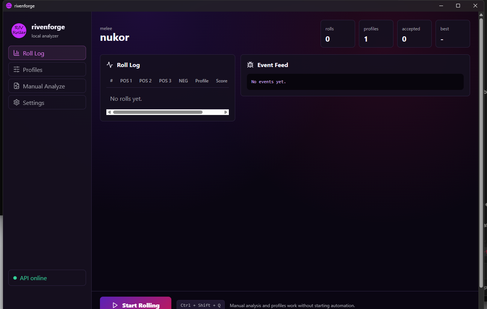
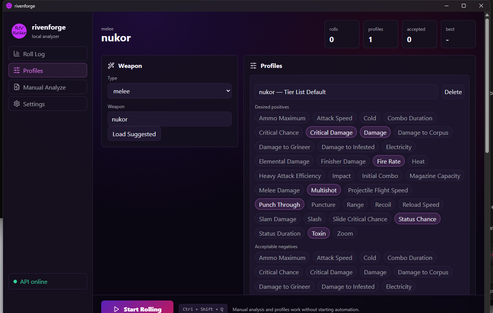
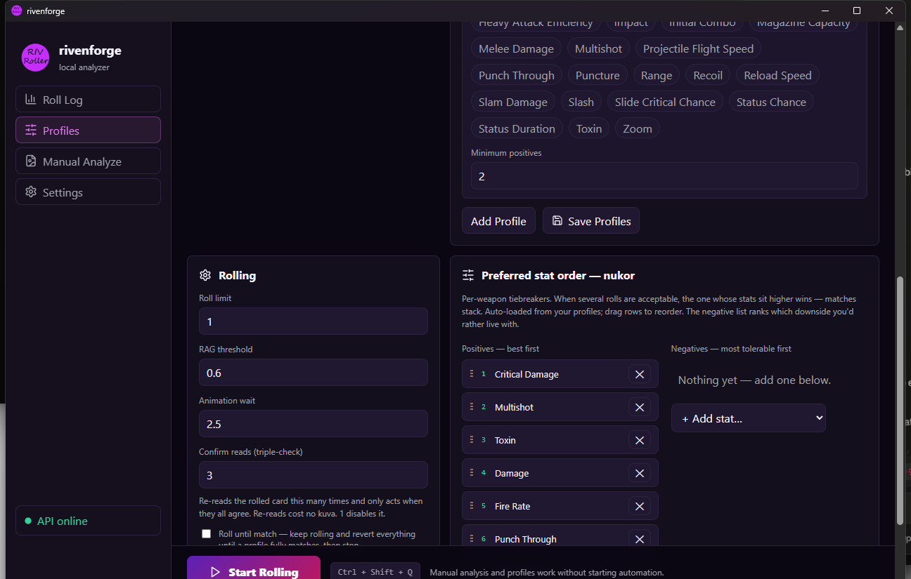
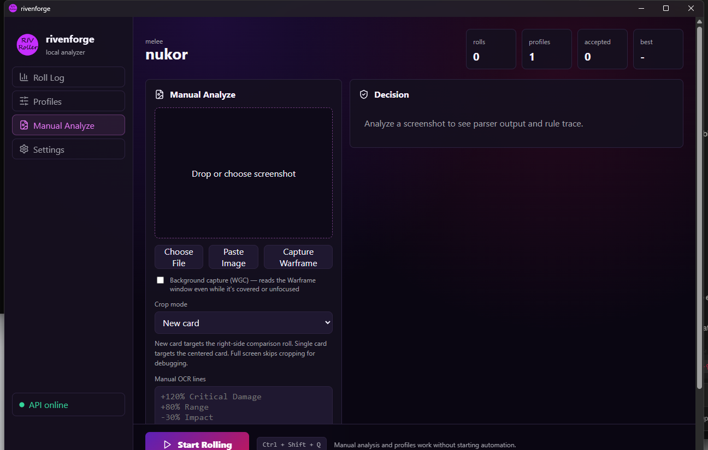
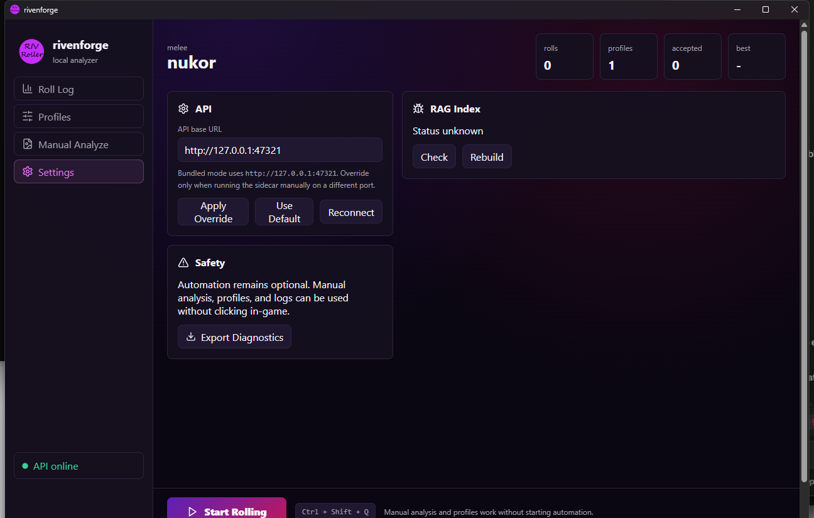

# rivenforge

rivenforge is a Windows-first Warframe riven analysis and rolling desktop app. It combines a polished React/Tauri interface, a local FastAPI sidecar, window capture, a name-decode + OCR reader, deterministic parsing, profile-based rule matching, and an advisory retrieval + live-market scoring layer.

> **On the scoring layer's name:** earlier builds called this "RAG." That was a misnomer and has been corrected. It is *retrieval + weighted scoring* — a TF-IDF index retrieves the most similar known rolls and a scorer combines that with a tier-list lookup and a live Warframe.Market price signal. There is **no generative model**, so it is not Retrieval-Augmented *Generation*. See [Roll Scoring](#roll-scoring-retrieval--market-signal).

The goal is reliability first: the app should be useful without touching the game, testable without OCR, and safe enough that bad OCR returns `REVIEW` instead of making a wrong roll decision.

## Screenshots

| Roll Log | Profiles |
|---|---|
|  |  |

| Stat hierarchy + triple-check | Manual Analyze |
|---|---|
|  |  |

<p align="center"></p>

## What It Does

- Analyzes saved riven screenshots or pasted clipboard images.
- Captures and analyzes the live Warframe window — including while it is **covered or unfocused** — via Windows.Graphics.Capture.
- Parses riven stat lines into structured positive and negative stats.
- Evaluates rolls against user-defined profiles instead of hardcoded "good roll" guesses.
- Explains why a roll matched, failed, or needs review.
- Uses a local retrieval + market-price scorer as advisory context for weapon tier/stat suggestions.
- Bundles the Python API as `rivenforge-api.exe` inside the Tauri desktop app.
- Ships a headless Linux container for the cross-platform half of the API (rules, scoring, manual-OCR analysis).
- Keeps automation optional and separate from OCR, rules, and profile testing.

## Roll-Decision Safeguards

Because a wrong KEEP wastes a real roll, several independent guards sit between OCR
and the keep/revert decision:

- **Physical-limit guard.** A real riven has at most 3 positives and 1 negative. Any
  read with more is marked `INVALID` (usually the two-card compare view bleeding the
  equipped riven in) and can never be kept.
- **Triple-check consensus.** Before acting, the rolled card is read several times
  (configurable, default 3) and must agree on the stat set. Re-reading costs no kuva,
  so an unstable/flaky read is retried until stable — or reverted as untrusted.
- **Recoil polarity + decorator handling.** `+Recoil` is treated as a negative and
  `-Recoil` as a positive; `(x2 for Bows)` / `(x2 for Heavy Attacks)` style annotations
  are stripped so the stat still resolves.
- **Per-weapon stat hierarchies.** Manual, drag-orderable positive and negative
  preference lists (auto-seeded from your profiles) tiebreak which acceptable roll wins.
- **Focus-safe automation.** The roller never steals focus back if you alt-tab to
  another app — it pauses until you return — and always releases modifier keys so the
  taskbar can't wedge.

## Current App

The main app is the Tauri/React desktop shell in `frontend/`. The older PyQt GUI remains in `gui/` until the Tauri version has complete feature parity.

Current React screens:

- Roll Log: session status and roll history.
- Profiles: weapon selection, profile generation, stat preferences, and config save flow.
- Manual Analyze: screenshot upload, clipboard paste, crop mode selection, manual OCR override, parse output, decision, and confidence.
- Settings: API connection, scoring-index status/rebuild, safety note, and diagnostic export.

The packaged app starts the sidecar automatically on:

```text
http://127.0.0.1:47321
```

## Figma And UI Direction

The UI was built from a Figma-style direction rather than left as a plain engineering panel. The visual target was a compact desktop tool with a dark violet/magenta Warframe-inspired look, clear navigation, visible status cards, and practical controls that feel like a real Windows app rather than a script wrapper.

That direction became the React/Tauri app:

- A persistent left navigation rail for Roll Log, Profiles, Manual Analyze, and Settings.
- High-contrast status cards for rolls, profiles, accepted/rejected counts, API state, and confidence.
- A manual analysis workflow designed around drag/drop, file selection, and clipboard paste.
- Profile controls that expose stat selection directly instead of hiding the rule system.
- A debug-friendly Settings screen with scoring-index rebuild and diagnostics export.

The UI is intentionally presentable because this project is also meant to demonstrate product engineering: frontend polish, local app packaging, sidecar integration, safety boundaries, and testing discipline all in one repo.

Screenshots should be added once the next stable build is captured, but the current UI work lives in `frontend/src/App.tsx` and `frontend/src/styles.css`.

## Architecture

```text
React/Tauri UI
    |
    | HTTP + WebSocket on localhost
    v
FastAPI sidecar
    |
    +--> OCR pipeline
    +--> parser
    +--> profile/rule engine
    +--> retrieval + market scoring
    +--> diagnostics/config/logging
```

Main folders:

- `frontend/`: React, TypeScript, Tauri shell, sidecar startup, app UI.
- `api/`: FastAPI endpoints used by the desktop shell.
- `core/`: parser, domain model, OCR pipeline, stat registry, rule engine, automation boundaries.
- `rag/`: the scoring layer — local tier-list index, TF-IDF retrieval, and Warframe.Market price-signal helpers. (Folder name is legacy from the earlier "RAG" label; it performs retrieval + scoring, not generation.)
- `data/`: generated JSON index, stat aliases, template assets.
- `tests/`: parser, rules, OCR pipeline, API, and config migration tests.
- `docs/`: architecture, profile schema, security, troubleshooting, and test plan notes.
- `.github/`: CI, release workflow, and issue templates.

The UI does not decide keep/roll directly. OCR does not decide keep/roll directly. The rule engine receives structured riven data and returns a decision with traces.

## How It Reads A Riven (Input Pipeline)

Reading the roll correctly is the hardest part of the whole app — the numbers are
small, the two-card compare view bleeds the old card into the new, and the layout
shifts between rolls. rivenforge uses a layered reader rather than trusting raw OCR:

1. **Capture the game window** via Windows.Graphics.Capture (WGC) — reads the actual
   Warframe window even when it's covered or unfocused, at a real 1920×1080 frame.
2. **Locate the card by anchoring on the CONFIRM button.** The selected (new) riven
   card always sits directly above CONFIRM, so the reader OCRs a thin strip to find
   CONFIRM's x-position, then crops the card column centered on it. This is what
   keeps the read on the right card no matter where the compare view drifts.
3. **Decode the positives from the riven's NAME.** A riven's generated name (e.g.
   `Seer Toxitron`) is a deterministic grammar over its positive stats — prefix,
   infix, and suffix syllables each map to a stat. Decoding the name (large, high-
   contrast text that OCRs cleanly) yields the positive set directly, instead of
   trying to read three tiny stat lines. See [`core/riven_names.py`](core/riven_names.py).
4. **OCR only what the name can't tell you: the negative** (and the displayed values).
   Faction-damage stats shown as multipliers (`x1.81` = +81%, `x0.58` = −42%) are
   parsed into signed percentages; wrapped stat names (`Ammo` / `Maximum`) are rejoined.
5. **Reconcile name + OCR** into one structured roll, and **triple-check it**: the card
   is read several times and the reads must agree on the stat set before the roll is
   trusted (re-reads cost no kuva). Empty or physically-impossible reads (more than 3
   positives / 1 negative — i.e. adjacent-card bleed) are discarded.

The result is a structured roll — positives, negative, values — that the rule engine
and scorer act on.

## Decision Flow

1. A game frame (or a loaded/pasted screenshot) enters the reader above.
2. Name-decode + OCR produce a structured, consensus-confirmed roll.
3. Low-confidence, empty, partial, or over-count reads return `REVIEW` and are never kept.
4. Valid structured stats are checked against your saved profiles.
5. The rule engine returns `KEEP`, `ROLL`, or `REVIEW` with an explanation trace.
6. The retrieval + market scorer is advisory only — it ranks acceptable rolls and
   surfaces plat value, but never overrides a profile decision.
7. On `KEEP` the roller confirms the new card; on `ROLL` it selects the old card and
   confirms that (a verified 3-step revert), never accidentally keeping the new roll.

This means a random Warframe.Market listing cannot force the app to keep something you
did not ask for. Profiles and read confidence are the guardrails.

## Crop Modes

Manual Analyze supports crop modes because Warframe's riven screen appears in a few different layouts.

- Single card: use when one riven card is centered on screen.
- Full card: use when the full visible card frame and text area need to be preserved for OCR.
- Full screenshot/options: use when comparing old/new roll options or when the card position has shifted after cycling.

The crop choice affects OCR input only. It does not change the rule profile or bypass review behavior.

## Rule Engine

Profiles are versioned JSON-compatible objects. A profile can express:

- required positive stat groups,
- 2 positive + 1 negative style profiles,
- 3 positive + 1 negative style profiles,
- OR groups,
- `Any` slots,
- safe negatives,
- rejected negatives,
- required negatives,
- explanation traces for matches and failures.

Examples of rule behavior:

- If a required positive group is missing, the failure says which group/stat was missing.
- If a rejected negative appears, the profile fails immediately.
- If OCR is partial or low confidence, the result is `REVIEW`, never `ROLL`.
- If no profile is configured, the result is `REVIEW`.

## Roll Scoring (Retrieval + Market Signal)

The scorer is local, lightweight, and **not RAG** — there is no generative model. It is
information retrieval plus a weighted heuristic. It does not upload screenshots or call a
cloud AI service.

A tier-list spreadsheet is ingested into two local files:

- `data/riven_index.json`: structured weapon entries — desired positives, acceptable
  negatives, notes, weapon type — one "document" per weapon (~417 entries).
- `data/tfidf_model.json`: a pure-Python **TF-IDF** model (bag-of-words term weights)
  used for lexical similarity retrieval.

At runtime, `rag/rag.py::score()` produces a `0.0–1.0` advisory score as a weighted sum:

```
score = 0.55 · tier_list_alignment   # set overlap: rolled stats vs the weapon's desired stats, minus a penalty per bad negative
      + 0.30 · market_price_signal    # live Warframe.Market plat price for those stats (rag/wfm.py)
      + 0.15 · tfidf_similarity       # cosine similarity of the roll query to the retrieved tier-list documents
      + melee_bonus                   # ±0.30 hand-tuned CD/Range priority when market data is sparse
```

What each piece actually is, stated plainly:

- **Retrieval** — TF-IDF cosine similarity over the document index returns the top-k most
  similar known rolls. This is classic *lexical* retrieval, not neural/semantic embeddings.
- **Alignment** — deterministic set math against the tier-list entry for the weapon.
- **Market** — a live API call to Warframe.Market for real plat prices.
- **Generation** — none. Nothing generates text from the retrieved context; the retrieval
  contributes 15% to a number. That is why this is retrieval-based *ranking*, not RAG.

Important: the score is **advisory, not control**. The deterministic profile/rule engine
owns every keep/roll decision. Market value can rank or explain a roll, but it can never
override your chosen profile.

## Background Capture And The Input Boundary

rivenforge can **read** the Warframe window in the background — while you are
focused on another app, and even while the window is covered by something else
or sitting on a second monitor. It cannot **click** in the background, and that
boundary was established empirically, not assumed.

### Capture backends (Windows host)

| Backend | Mechanism | Reaches |
|---|---|---|
| `mss` | GDI / BitBlt of the window region | foreground / visible, uncovered |
| `dxgi` | dxcam Desktop Duplication | Fullscreen Exclusive; used when the mss frame is black |
| `wgc` | Windows.Graphics.Capture on the Warframe **window** | the window even when **covered / unfocused / on a 2nd monitor** |

`POST /capture/analyze` with `backend=wgc` (or the "Background capture" checkbox
on Manual Analyze) selects the window-targeted path. WGC is the same
Microsoft-sanctioned API OBS's Window Capture uses — **no process injection, no
hooks**. The one hard OS limit shared by every backend: a *minimized* window has
no composed surface and cannot be captured.

### Why rolling stays foreground-only

Automated clicking in the background was tested and does not work: Warframe reads
raw hardware input, so posted (`PostMessage`) events are ignored, and hardware /
`SendInput` events are routed by Windows to the focused window. `POST
/capture/input-probe` performs a non-destructive hover test (no click, no kuva
spent) so this is verifiable rather than a claim. rivenforge deliberately does
**not** cross into DLL injection or input drivers to force the issue. Net result:
**background analysis works; automated rolling stays foreground-only.**

## API Surface

The local sidecar exposes endpoints such as:

- `GET /health`
- `GET /stats`
- `GET /config`
- `PUT /config`
- `GET /weapons`
- `GET /weapons/{name}/suggested`
- `POST /analyze`
- `GET /capture/status`
- `POST /capture/analyze` (`backend=auto|wgc`)
- `POST /capture/input-probe`
- `POST /roll/start`
- `POST /roll/stop`
- `GET /rag/status`
- `POST /rag/rebuild`
- `GET /diagnostics/export`
- `WS /events`

The sidecar binds to `127.0.0.1` only.

## Run From Source

Install Python dependencies:

```powershell
python -m pip install -r requirements.txt -r requirements-dev.txt
```

Install frontend dependencies and run the Tauri app:

```powershell
cd frontend
npm install
npm run sidecar:build
npm run tauri dev
```

Run only the API sidecar:

```powershell
python api_sidecar.py
```

## Launchers

Two Windows `.bat` files at the repo root:

- `run-rivenforge.bat` — launch the installed desktop app.
- `run-rivenforge-dev.bat` — run the sidecar from source, then launch the
  installed app against it. The Tauri shell reuses an already-listening sidecar,
  so this exercises the latest `core/` and `api/` code **without a rebuild**.
  Pass `--api-only` to start just the sidecar for endpoint testing.

## Headless API Container

`Dockerfile` and `docker-compose.yml` build a Linux image that serves the
**cross-platform** half of the API (rules, scoring, config, weapons, stats, and
manual-OCR analysis) using `requirements-api.txt`:

```bash
docker compose up --build
curl http://localhost:47321/health
```

Live screen/window capture and image OCR are Windows-only (`winocr`, `dxcam`,
Windows.Graphics.Capture) and are not available in the container — those
endpoints degrade gracefully (`/capture/status` reports `available: false`)
instead of crashing.

## Build Windows Installers

Install Rust and Visual Studio C++ Build Tools, then:

```powershell
python -m pytest -q
cd frontend
npm run build
npm run sidecar:build
npm run tauri build
```

Outputs:

- `frontend/src-tauri/target/release/rivenforge.exe`
- `frontend/src-tauri/target/release/bundle/nsis/rivenforge_*_x64-setup.exe`
- `frontend/src-tauri/target/release/bundle/msi/rivenforge_*_x64_en-US.msi`

## Tests And Tooling

```powershell
python -m pytest -q
python -m ruff check api core tests data_util.py api_sidecar.py
python -m mypy --follow-imports=skip api tests/test_api.py tests/test_config_migration.py data_util.py api_sidecar.py
cd frontend
npm run build
```

GitHub Actions runs Python tests, Ruff, mypy, frontend build, sidecar packaging, and a Tauri packaging check.

## Safety Boundaries

rivenforge does not use memory reading, game injection, packet manipulation, stealth behavior, anti-detection bypasses, kernel drivers, or hidden background behavior.

Screenshots and diagnostics stay local unless the user explicitly exports and shares them. Automation remains optional; manual screenshot analysis and profile testing work without any in-game clicking.

## Roadmap

- ~~Improve OCR reliability while Warframe is not the focused window.~~ Done via the WGC background-capture backend.
- Expand fixture-based OCR regression tests.
- Finish Tauri feature parity before removing the PyQt GUI.
- Improve profile import/export and sample profiles.
- Add clearer diagnostics around failed OCR/crop detection.
- Package repeatable Windows releases through GitHub Actions.

## License

No open-source license has been selected yet. All rights are reserved unless a license is added later.
